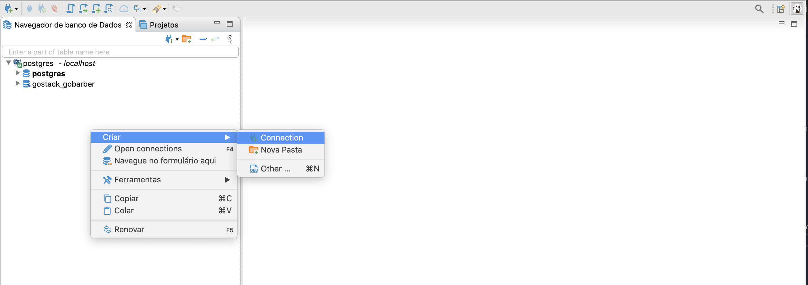
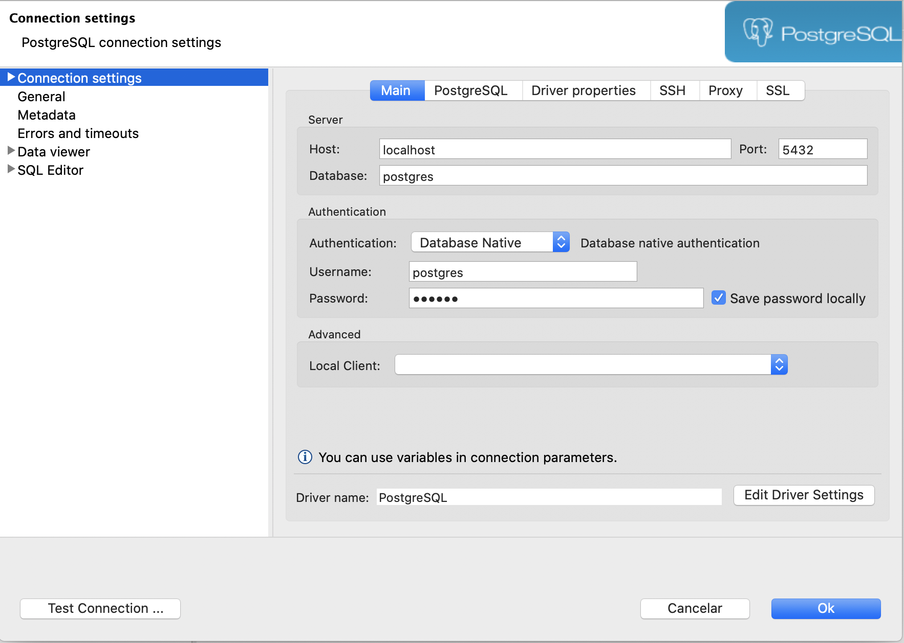
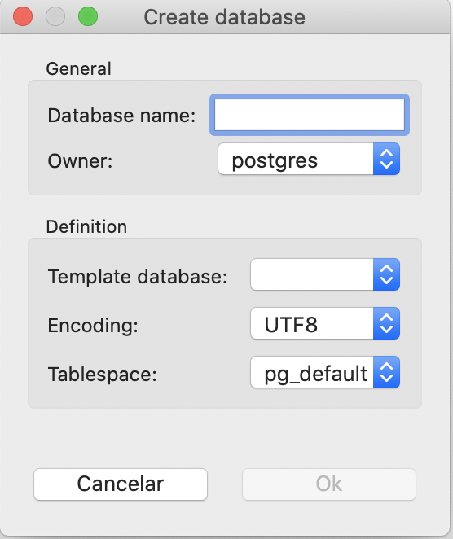

# ABOUT THE PROJECT

- Socket API is used to make real time chat app and deal with messages and user requests

- Every element of the express api is decoupled.
  - Code was made using DDD Principles, to split responsabilities on layers
  - Modules are decoupled components inside this app.
    - Messages: Component that allow every request about messages ( creating messages and consulting)
    - Users: User creation and session control
    - Stock Prices Bot: Stock Api consulting

- To run your code execute following steps:
  - Create config files for your application
  - Create and Run your postgres database
  - Start project using yarn
  - Using postman or insomnia, create the users that will be allowed to use the chat
  - open chat app on browser and test the application

** I could not integrate with rabbitMQ broker, this is the only point that I missed. **
** The main reason is: I've never worked with rabbitMQ as a broker. When I tried to integrate, my application crashed. I'd rather send you a functional application without broker than something that has problems **

# ORMCONFIG and .ENV files
## ORMCONFIG

This is going to connect node with your database, allowing your application to use all functionalities.

Uncomment ormconfig.sample.json and put your password to run this application.

## .ENV file
this will config PORTs for socketIO and Express and the secret used for your token JWT.

**READ THIS: to connect the frontend with socket I used PORT_SOCKET=3000. If you want to change this port, you have to change the connection url within app.js**

**So, enter inside assets/frontend_assets/app.js and change 'http://localhost:(YOUR AMAZING PORT)'**
```javascript
const socket = io.connect('http://localhost:3000', {
  forceNew: true,
});
```

# DATABASE
## Docker config
- First of all, you must create a postgres database at docker using the CLI command above:
- If you don't have installed a postgres image, this command will install for you
- may take a few minutes to install, so go take a coffee  ☕️

```terminal
docker run --name <NAME TO FIND IN DOCKER> -e POSTGRES_PASSWORD=<YOUR AMAZING PASSWORD> -p 5432:5432 -d postgres
```

- after install, your image is running at port 5432 ( -p 5432:5432 means the external_port:container:port )
- if you already installed postgres without docker, this port should be in use, so choose another port (I really recommend to use 5433, 5435,..., change only the last number, this will make it easy to find later)

## DBEAVER
- To see all data inside your database, one option is to install DBEAVER in your computer ( there are more options, choose your favorite)
- create a new connection with postgres on dbeaver



- if you don't put an username, the default is [postgres]
- and the password is the amazing password you put on docker command



- After that, you must create a database:
  - Right click on your connection -> create -> database
  - put a database name, the enconding must be UTF-8 and keep others as default



## ORM Config
You must create a config file at the root level of your app, to configure the connections with database (like ormconfig.sample.json)

```javascript
{
  "type": "postgres",
  "host": "localhost",
  "port": 5432,
  "username": "postgres",
  "password": "<YOUR AMAZING PASSWORD>",
  "database": "gostack_gobarber",
  "entities": [
    "./src/models/*.ts"
  ],
  "migrations": [
    "./src/database/migrations/*.ts"
  ],
  "cli": {
    "migrationsDir": "./src/database/migrations"
  }
}
```

- Important Definitions:

  - entities:
    - the routes for your entities ( models inside your app )

  - migrations:
    - all files where the migrations are located
    - can be more than one,

  - cli: migrationDir
    - folder where your migrations files are
    - this is used to locate and run migrations.


# Migrations

Migrations are like a github for your database, it controls the version and state of your database.

To start this project, please run every migration using.

**If your database is not up, this won't work. Please ensure your database is working on correct port.**

``` yarn typeorm migration:run ```

## Migrations commands

To use migrations commands, go to your package.json and add a script like this:

```javascript
  "scripts": {
    "typeorm": "ts-node-dev ./node_modules/typeorm/cli.js"
  }
```

**THIS SCRIPTS ARE ALREADY CONFIGURED, THIS IS ONLY FOR UNDERSTANDING PURPOISE**

If something went wrong, revert migrations and run again.

A little list of usefull commands for migrations
<strong>Show all migrations state</strong>

  - ``` yarn typeorm migration:show ```

<strong>Create migration</strong>

  - ``` yarn typeorm migration:create -n CreateAppointments ```

<strong>Run All Migration</strong>

  - ``` yarn typeorm migration:run ```

<strong>Revert last migration</strong>

  - ``` yarn typeorm migration:revert ```

# START PROJECT

To start project, please download all packages using yarn ( digit "yarn" at root of this project)

After that, you should config the postgres database on your machine ( above has a short explanation how to make it with docker, but feel free to config as you like).

Config ormconfig.json and .env files ( below has an explanation about both)

Start project using this command:
``` yarn dev:server ```

## Creating users

- Open insomnia or postman, and make the following request:
```
URL: http://localhost:(PORT)/users/
METHOD: POST
Body: {
	"name": "RENAN",
	"email": "renanmascg@gmail.com",
	"password": "123456"
}
```

- Now, this user has access to chat app.

## GETTING CHAT APP FRONTEND

This files are served as static files.

Open your favorite browser (use chrome to avoid unconventional errors) on url:
  - http://localhost:(PORT)/files/index.html

Then you can make a login with any user created using api.

Some bussiness rules about the chat:
  - there are no session keeper, so when you refresh the page, will be necessary to make login again
  - When you entered the chat, this will load only the last 50 messages (ordered by timestamp)
  - during the use, any additional message is going to be added to the message list.
